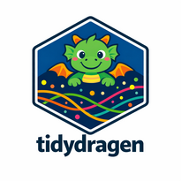

<!-- README.md is generated from README.qmd. Please edit that file -->

<a href="https://tidywf.github.io/tidydragen"></a>

# Tidy Illumina DRAGEN Outputs

[](https://anaconda.org/tidywf/r-tidydragen)
[](https://github.com/tidywf/tidydragen/actions/workflows/deploy.yaml)
[](https://github.com/tidywf/tidydragen/pkgs/container/tidydragen)

## Contents

- [tidydragen](#tidydragen)
- [Documentation](#documentation)
- [Quick Start](#quickstart)
  - [Single tool](#single-tool)
  - [Full DRAGEN run](#full-dragen-run)
- [Installation](#installation)
- [CLI](#cli)

## tidydragen

tidydragen is an R package for parsing and tidying output from
Illumina’s
[DRAGEN](https://www.illumina.com/products/by-type/informatics-products/dragen-secondary-analysis.html "Illumina DRAGEN")
secondary-analysis pipelines. The following pipelines are supported: DNA
tumor-normal (somatic), DNA germline-only, RNA tumor-only, and TSO500
ctDNA.

A DRAGEN run produces dozens of files per sample across mapping,
coverage, variant calling, RNA quantification, and (for the ctTSO500
app) combined-variant and coverage reports. Consuming them downstream is
fragile: most metrics land in headerless
`section,rg,variable,count[,pct]` CSVs, some files fan out into several
logical tables, region/phenotype variants share basenames, and column
layouts drift between DRAGEN versions.

tidydragen addresses this with a schema-driven parsing layer built on
the [nemo](https://github.com/tidywf/nemo "nemo") base R6 classes,
supplying DRAGEN-specific schemas and parsers that turn raw outputs into
consistently structured, versioned, analysis-ready tables. These can be
written to Apache Parquet, PostgreSQL, TSV, CSV, or RDS. Each run also
produces a `metadata.parquet` file alongside the tidy tables, capturing
IDs, paths, and R package versions.

## Documentation

- Installation:
  <https://tidywf.github.io/tidydragen/articles/installation>
- Quickstart: <https://tidywf.github.io/tidydragen/articles/quickstart>
- Files supported:
  <https://tidywf.github.io/tidydragen/articles/schema_table>
- Output naming:
  <https://tidywf.github.io/tidydragen/articles/output_naming>
- Structure: <https://tidywf.github.io/tidydragen/articles/structure>
- Changelog: <https://tidywf.github.io/tidydragen/articles/NEWS>
- R6: <https://tidywf.github.io/nemo/articles/structure>

## Quickstart

### Single tool

Each DRAGEN tool has its own R6 class. Most DRAGEN metrics files share a
headerless `section,rg,variable,count[,pct]` layout e.g.:

``` r
indir_map <- system.file("extdata/dragenmap", package = "tidydragen")
writeLines(head(
  readLines(
    file.path(indir_map, "sampleA.mapping_metrics.csv")
  ),
  5
))
#> TUMOR MAPPING/ALIGNING SUMMARY,,Total input reads,2635326658,100.00
#> TUMOR MAPPING/ALIGNING SUMMARY,,Number of duplicate marked reads,524058237,19.89
#> TUMOR MAPPING/ALIGNING SUMMARY,,Number of duplicate marked and mate reads removed,NA
#> TUMOR MAPPING/ALIGNING SUMMARY,,Number of unique reads (excl. duplicate marked reads),2111268421,80.11
#> TUMOR MAPPING/ALIGNING SUMMARY,,Reads with mate sequenced,2635326658,100.00
```

We can use the `DragenMap` class to parse, tidy, and write these files
in one call via its `run()` method:

``` r
outdir_map <- file.path(tempdir(), "map_out")
DragenMap$new(indir_map)$run(
  output_dir = outdir_map,
  format = "parquet",
  input_id = "run1"
)
list.files(outdir_map, pattern = "\\.parquet$")
#>  [1] "metadata_dragenmap.parquet"               "sampleA_dragenmap_fraglenhist.parquet"   
#>  [3] "sampleA_dragenmap_gcbias.parquet"         "sampleA_dragenmap_gcmain.parquet"        
#>  [5] "sampleA_dragenmap_metrics.parquet"        "sampleA_dragenmap_replayconfig.parquet"  
#>  [7] "sampleA_dragenmap_replaymain.parquet"     "sampleA_dragenmap_time.parquet"          
#>  [9] "sampleA_dragenmap_trimmer.parquet"        "sampleA_dragenmap_umihist.parquet"       
#> [11] "sampleA_dragenmap_umimain.parquet"        "sampleB_2_dragenmap_replayconfig.parquet"
#> [13] "sampleB_2_dragenmap_replaymain.parquet"   "sampleB_2_dragenmap_time.parquet"        
#> [15] "sampleB_dragenmap_replayconfig.parquet"   "sampleB_dragenmap_replaymain.parquet"    
#> [17] "sampleB_dragenmap_time.parquet"
```

Now read back one tidied table:

``` r
file.path(outdir_map, "sampleA_dragenmap_metrics.parquet") |>
  arrow::read_parquet() |>
  str(list.len = 10)
#> tibble [4 × 131] (S3: tbl_df/tbl/data.frame)
#>  $ input_id                                 : chr [1:4] "run1" "run1" "run1" "run1"
#>  $ section                                  : chr [1:4] "TUMOR" "NORMAL" "TUMOR" "NORMAL"
#>  $ rg                                       : chr [1:4] "Total" "Total" "CAAGCTAG+CGCTATGT.4.260813_A01052_0316_AHTYNTDSXF" "CAGTAGGC+ATTCGTCA.3.260813_A01052_0316_AHTYNTDSXF"
#>  $ reads_tot_input                          : num [1:4] 2.64e+09 9.39e+08 NA NA
#>  $ reads_tot_input_pct                      : num [1:4] 100 100 NA NA
#>  $ reads_num_dupmarked                      : num [1:4] 5.24e+08 1.31e+08 5.24e+08 1.31e+08
#>  $ reads_num_dupmarked_pct                  : num [1:4] 19.9 13.9 19.9 13.9
#>  $ reads_num_dupmarked_mate_reads_removed   : num [1:4] NA NA NA NA
#>  $ reads_num_uniq                           : num [1:4] 2.11e+09 8.08e+08 2.11e+09 8.08e+08
#>  $ reads_num_uniq_pct                       : num [1:4] 80.1 86.1 80.1 86.1
#>   [list output truncated]
```

### Full DRAGEN run

A whole DRAGEN results directory can be processed with the `Dragen`
workflow class. Tools whose files are absent contribute nothing, so the
same call works across the germline, somatic tumor-normal, and RNA
pipelines:

<details class="code-fold">
<summary>View input files</summary>

``` r
indir_d <- system.file("extdata", package = "tidydragen")
dir_tree(indir_d)
/home/runner/miniconda3/envs/bump_env/lib/R/library/tidydragen/extdata
├── dragenbcl
│   ├── Adapter_Cycle_Metrics.csv
│   ├── Adapter_Cycle_Metrics.csv.dvc
│   ├── Adapter_Metrics.csv
│   ├── Adapter_Metrics.csv.dvc
│   ├── Demultiplex_Stats.csv
│   ├── Demultiplex_Stats.csv.dvc
│   ├── Demultiplex_Tile_Stats.csv
│   ├── Demultiplex_Tile_Stats.csv.dvc
│   ├── Index_Hopping_Counts.csv
│   ├── Index_Hopping_Counts.csv.dvc
│   ├── Quality_Metrics.csv
│   ├── Quality_Metrics.csv.dvc
│   ├── Quality_Tile_Metrics.csv
│   ├── Quality_Tile_Metrics.csv.dvc
│   ├── RunInfo.xml
│   ├── RunInfo.xml.dvc
│   ├── Top_Unknown_Barcodes.csv
│   ├── Top_Unknown_Barcodes.csv.dvc
│   ├── fastq_list.csv
│   └── fastq_list.csv.dvc
├── dragencov
│   ├── sampleA.exon_coverage_metrics.csv
│   ├── sampleA.exon_coverage_metrics.csv.dvc
│   ├── sampleA.qc-coverage-region-umccr_cov_report.bed
│   ├── sampleA.qc-coverage-region-umccr_cov_report.bed.dvc
│   ├── sampleA.qc-coverage-region-umccr_read_cov_report.bed
│   ├── sampleA.qc-coverage-region-umccr_read_cov_report.bed.dvc
│   ├── sampleA.target_bed_coverage_metrics.csv
│   ├── sampleA.target_bed_coverage_metrics.csv.dvc
│   ├── sampleA.wgs_contig_mean_cov.csv
│   ├── sampleA.wgs_contig_mean_cov.csv.dvc
│   ├── sampleA.wgs_contig_mean_cov_normal.csv
│   ├── sampleA.wgs_contig_mean_cov_normal.csv.dvc
│   ├── sampleA.wgs_contig_mean_cov_tumor.csv
│   ├── sampleA.wgs_contig_mean_cov_tumor.csv.dvc
│   ├── sampleA.wgs_coverage_metrics.csv
│   ├── sampleA.wgs_coverage_metrics.csv.dvc
│   ├── sampleA.wgs_fine_hist.csv
│   └── sampleA.wgs_fine_hist.csv.dvc
├── dragenfqc
│   ├── sampleA.fastqc_metrics.csv
│   └── sampleA.fastqc_metrics.csv.dvc
├── dragenmap
│   ├── cttso-dragencaller
│   │   ├── sampleB-replay.json
│   │   ├── sampleB-replay.json.dvc
│   │   ├── sampleB.time_metrics.csv
│   │   └── sampleB.time_metrics.csv.dvc
│   ├── cttso-tmb
│   │   ├── sampleB-replay.json
│   │   ├── sampleB-replay.json.dvc
│   │   ├── sampleB.time_metrics.csv
│   │   └── sampleB.time_metrics.csv.dvc
│   ├── sampleA-replay.json
│   ├── sampleA-replay.json.dvc
│   ├── sampleA.fragment_length_hist.csv
│   ├── sampleA.fragment_length_hist.csv.dvc
│   ├── sampleA.gc_metrics.csv
│   ├── sampleA.gc_metrics.csv.dvc
│   ├── sampleA.mapping_metrics.csv
│   ├── sampleA.mapping_metrics.csv.dvc
│   ├── sampleA.time_metrics.csv
│   ├── sampleA.time_metrics.csv.dvc
│   ├── sampleA.trimmer_metrics.csv
│   ├── sampleA.trimmer_metrics.csv.dvc
│   ├── sampleA.umi_metrics.csv
│   └── sampleA.umi_metrics.csv.dvc
├── dragenrna
│   ├── sampleA.fusion_metrics.csv
│   ├── sampleA.fusion_metrics.csv.dvc
│   ├── sampleA.quant_metrics.csv
│   └── sampleA.quant_metrics.csv.dvc
├── dragentso
│   ├── sampleA.exon_cov_report.tsv
│   ├── sampleA.exon_cov_report.tsv.dvc
│   ├── sampleA.gene_cov_report.tsv
│   ├── sampleA.gene_cov_report.tsv.dvc
│   ├── sampleA.tmb.msaf.csv
│   ├── sampleA.tmb.msaf.csv.dvc
│   ├── sampleA.tmb.trace.tsv
│   ├── sampleA.tmb.trace.tsv.dvc
│   ├── sampleA_CombinedVariantOutput.tsv
│   ├── sampleA_CombinedVariantOutput.tsv.dvc
│   ├── sampleA_Fusions.csv
│   ├── sampleA_Fusions.csv.dvc
│   ├── sampleA_SampleAnalysisResults.json
│   └── sampleA_SampleAnalysisResults.json.dvc
├── dragenvar
│   ├── sampleA.allele_transition_noise_metrics.csv
│   ├── sampleA.allele_transition_noise_metrics.csv.dvc
│   ├── sampleA.cnv_metrics.csv
│   ├── sampleA.cnv_metrics.csv.dvc
│   ├── sampleA.contamination.json
│   ├── sampleA.contamination.json.dvc
│   ├── sampleA.gvcf_metrics.csv
│   ├── sampleA.gvcf_metrics.csv.dvc
│   ├── sampleA.hrdscore.csv
│   ├── sampleA.hrdscore.csv.dvc
│   ├── sampleA.microsat_output.json
│   ├── sampleA.microsat_output.json.dvc
│   ├── sampleA.ploidy.vcf.gz
│   ├── sampleA.ploidy.vcf.gz.dvc
│   ├── sampleA.ploidy_estimation_metrics.csv
│   ├── sampleA.ploidy_estimation_metrics.csv.dvc
│   ├── sampleA.sv_metrics.csv
│   ├── sampleA.sv_metrics.csv.dvc
│   ├── sampleA.tmb.metrics.csv
│   ├── sampleA.tmb.metrics.csv.dvc
│   ├── sampleA.vc_hethom_ratio_metrics.csv
│   ├── sampleA.vc_hethom_ratio_metrics.csv.dvc
│   ├── sampleA.vc_metrics.csv
│   ├── sampleA.vc_metrics.csv.dvc
│   ├── sampleB.cnv_metrics.csv
│   ├── sampleB.cnv_metrics.csv.dvc
│   ├── sampleB.ploidy_estimation_metrics.csv
│   ├── sampleB.ploidy_estimation_metrics.csv.dvc
│   ├── sampleB.vc_metrics.csv
│   └── sampleB.vc_metrics.csv.dvc
└── interop
    ├── imaging_tables
    │   ├── compressed
    │   │   ├── imaging_table.csv.gz
    │   │   └── imaging_table.csv.gz.dvc
    │   └── uncompressed
    │       ├── imaging_table.csv
    │       └── imaging_table.csv.dvc
    └── summaries
        ├── runA-index_summary.csv
        ├── runA-index_summary.csv.dvc
        ├── runA_summary.csv
        └── runA_summary.csv.dvc
```

</details>

We can parse, tidy, and write the results into e.g. Parquet format as
follows:

``` r
outdir_d <- file.path(tempdir(), "dragen_out_parquet")
d <- Dragen$new(indir_d)
res <- d$run(
  output_dir = outdir_d,
  format = "parquet",
  input_id = "run1",
  output_id = "out1",
  prefix_include = TRUE
)
res # shows summary of Dragen object
#> #--- Workflow Dragen ---#
#> 
#> |var           |value                                                                  |
#> |:-------------|:----------------------------------------------------------------------|
#> |name          |Dragen                                                                 |
#> |path          |/home/runner/miniconda3/envs/bump_env/lib/R/library/tidydragen/extdata |
#> |ntools        |8                                                                      |
#> |files_total   |118                                                                    |
#> |files_matched |59                                                                     |
#> |tidied        |true                                                                   |
#> |written       |true                                                                   |
list.files(outdir_d, pattern = "\\.parquet$") |> sort() |> str()
#>  chr [1:89] "dragenbcl_adaptercyclemetrics.parquet" "dragenbcl_adaptermetrics.parquet" ...
```

Results can also be written to a PostgreSQL database with
`format = "db"` and a DBI connection (see the [PostgreSQL
article](https://tidywf.github.io/tidydragen/articles/postgresql)).

Three optional columns can be prepended to every written table to
support downstream tracing and joining. All are opt-in and off by
default, but highly recommended for any multi-sample or multi-run
pipeline:

| Column | Purpose | User-supplied or auto-generated? |
|----|----|----|
| `input_id` | identifies the sample or input run | user |
| `output_id` | identifies the tidydragen processing run | user or auto (ULID) |
| `input_prefix` | filename prefix (e.g. sample name) | auto |

## Installation

Using {remotes} directly from GitHub:

``` r
install.packages("remotes")
remotes::install_github("tidywf/tidydragen") # latest main commit
remotes::install_github("tidywf/tidydragen@v0.0.0.9003") # specific version
```

Alternatively:

- conda package: <https://anaconda.org/tidywf/r-tidydragen>
- Docker image:
  <https://github.com/tidywf/tidydragen/pkgs/container/tidydragen>

For more details see:
<https://tidywf.github.io/tidydragen/articles/installation>

## CLI

A `tidydragen.R` command line interface is available for convenience.

- If you’re using the conda package, the `tidydragen.R` command will
  already be available inside the activated conda environment.
- If you’re *not* using the conda package, you need to export the
  `tidydragen/inst/cli/` directory to your `PATH` in order to use
  `tidydragen.R`.

``` bash
td_cli=$(Rscript -e 'x = system.file("cli", package = "tidydragen"); cat(x, "\n")' | xargs)
export PATH="${td_cli}:${PATH}"
```

    $ tidydragen.R --version
    tidydragen 0.0.0.9003

    #-----------------------------------#
    $ tidydragen.R --help
    usage: tidydragen.R [-h] [-v] {tidy,list,sync} ...

    ✨ DRAGEN Output Tidying ✨

    positional arguments:
      {tidy,list,sync}  sub-command help
        tidy            Tidy Workflow Outputs
        list            List Parsable Workflow Outputs
        sync            Sync Parsable Workflow Outputs From AWS S3

    options:
      -h, --help        show this help message and exit
      -v, --version     show program's version number and exit
    '
    #-----------------------------------#
    #------- Tidy ----------------------#
    $ tidydragen.R tidy --help
    usage: tidydragen.R tidy [-h] -d IN_DIR [-o OUTPUT_DIR] [-f FORMAT]
                             [--input_id INPUT_ID] [--output_id OUTPUT_ID |
                             --ulid] [--dbname DBNAME] [--dbuser DBUSER]
                             [--dbhost DBHOST] [--dbport DBPORT]
                             [--include INCLUDE] [--exclude EXCLUDE]
                             [--prefix_include] [-q]

    options:
      -h, --help            show this help message and exit
      -d, --in_dir IN_DIR   Input directory.
      -o, --output_dir OUTPUT_DIR
                            Output directory.
      -f, --format FORMAT   Format of output [def: parquet] (parquet, db, tsv,
                            csv, rds)
      --input_id INPUT_ID   Input ID for this run.
      --output_id OUTPUT_ID
                            Output ID for this run.
      --ulid                Generate a ULID as output ID.
      --dbname DBNAME       Database name.
      --dbuser DBUSER       Database user.
      --dbhost DBHOST       Database host (default: driver/env default, e.g.
                            PGHOST).
      --dbport DBPORT       Database port (default: driver/env default, e.g.
                            PGPORT).
      --include INCLUDE     Include only these files (comma sep tool_parsers).
      --exclude EXCLUDE     Exclude only these files (comma sep tool_parsers).
      --prefix_include      Include input prefix column in output tables.
      -q, --quiet           Shush all the logs.

    #-----------------------------------#
    #------- List ----------------------#
    $ tidydragen.R list --help
    usage: tidydragen.R list [-h] -d IN_DIR [-f FORMAT] [-m MAX] [-q]

    options:
      -h, --help           show this help message and exit
      -d, --in_dir IN_DIR  Input directory.
      -f, --format FORMAT  Format of list output [def: pretty] (tsv, pretty)
      -m, --max MAX        Max rows to show.
      -q, --quiet          Shush all the logs.
